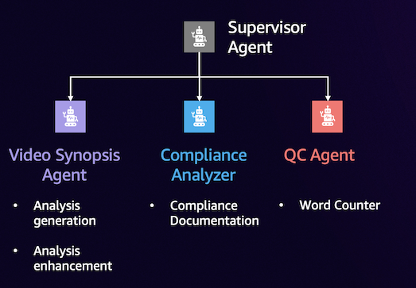

# Media Analysis with Generative AI on AWS

This module demonstrates how to build intelligent media analysis agents using Amazon Bedrock and other AWS services. The agents can analyze video content, identify key figures, and generate metadata for different platforms.

### Multi-agent Architecture

The modules will progressively build up to the final multi-agent architecture.

1. **Synopsis Agent**: Generates metadata based on video analysis and requirements
2. **Compliance Analyzer**: Retrieves compliance requirements from a knowledge base
3. **QC Agent**: Performs quality checks on the generated metadata
4. **Supervisor Agent**: Orchestrates the entire workflow

## Modules Overview

### 2. Film Agent Using Bedrock

A foundational agent that analyzes film content using Amazon Bedrock and AWS Rekognition. This agent can:
- Extract video analysis using Bedrock Data Automation
- Match videos to film titles using a knowledge base
- Identify key cast members using AWS Rekognition celebrity detection
- Query additional cast information from DynamoDB

### 3. Film Inline Agent with MCP Using Bedrock

Rebuilds the Film Agent using Bedrock Inline Agents and Model Context Protocol (MCP) integration. This approach offers:
- Dynamic configuration of agents at runtime
- Rapid prototyping and debugging capabilities
- Better separation of concerns between agent logic and tool implementation
- Seamless integration with external tools and services

### 4. Film Agent Using Strands SDK

Implements the Film Agent using the Strands Agents SDK, an open-source framework for building AI agents. Features include:
- Model-driven approach to agent development
- Support for multiple model providers (Amazon Bedrock, Anthropic, Meta, Ollama)
- Python-based tools with simple decorator syntax
- Built-in MCP support for tool integration
- Knowledge base integration for information retrieval

### 5. Media Operations Multi-agent Using Bedrock

Demonstrates the "Agents as Tools" pattern with a sophisticated multi-agent system for media operations. The system includes:
- Supervisor Agent: Orchestrates the entire workflow
- Synopsis Agent: Generates metadata based on video analysis
- Compliance Analyzer: Retrieves compliance requirements from a knowledge base
- QC Agent: Performs quality checks on generated metadata

## Prerequisites

Before running these notebooks:
1. Run `00-prerequisites.ipynb` to set up all required packages
2. For modules 3 and 4, make sure to run module 2 first to generate necessary resources like knowledge base and DynamoDB tables

## Getting Started

Each module is contained in its own directory with a Jupyter notebook that walks through the implementation step by step. Start with module 1 and progress through the modules to build increasingly sophisticated agent systems.

## Key Technologies

- **Amazon Bedrock**: Foundation models for natural language understanding and generation
- **Amazon Bedrock Agents**: Framework for building AI agents with knowledge bases and action groups
- **Amazon Bedrock Inline Agents**: Lightweight framework for dynamic agent configuration
- **AWS Rekognition**: Computer vision for celebrity detection and video analysis
- **Amazon DynamoDB**: NoSQL database for storing cast information
- **Model Context Protocol (MCP)**: Standardized integration framework for AI agents
- **Strands Agents SDK**: Open-source framework for building AI agents

## Cleanup

Each notebook includes cleanup instructions to delete resources when you're done to avoid unnecessary charges.