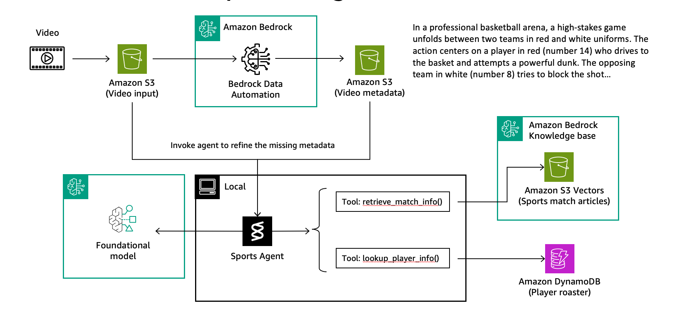

## Building Sports Agents using Strands Agents

Sports broadcasters need complete metadata for their video content: event names, venue details, team names, and player identification. This notebook demonstrates how to build an intelligent agent that automatically enriches sports video with missing information.

We'll use **Strands Agents**, AWS's open-source SDK for building production-ready agent workflows. A Strands agent combines three core components: **tools** (for data access), **model** (for reasoning), and **prompt** (for behavior guidance).



## Agent Architecture

Our sports agent uses two specialized tools to gather comprehensive information:

**Tool 1: Knowledge Base Retrieval** - Searches sports articles and match reports to identify teams, venues, dates, and game context from published coverage.

**Tool 2: Player Database Lookup** - Retrieves detailed player information (name, position, stats) using team name and jersey number visible in the video.

## Implementation

### Defining the Tools

The notebook shows how to implement these tools using AWS services:

```python
@tool
def retrieve_match_info(query: str, max_results: int = 1) -> str:
    """
    Search the sports knowledge base for match reports containing team names,
    venues, dates, scores, and game details. Use this to identify which teams
    are playing in the video.
    """
    try:
        response = bedrock_agent_runtime.retrieve(
            knowledgeBaseId=lab_kb_id,
            retrievalQuery={'text': query},
            retrievalConfiguration={
                'vectorSearchConfiguration': {
                    'numberOfResults': max_results
                }
            }
        )
        return json.dumps(response.get('retrievalResults', []))
    except Exception as e:
        return json.dumps({"error": str(e),
                          "note": "Falling back to video analysis only"})

@tool
def lookup_player_info(team_name: str, player_number: str) -> str:
    """
    Look up detailed player information from the player database.
    Requires the exact team name from match reports and the player's
    jersey number from the video.
    """
    try:
        table = dynamodb.Table(lab_dynamo_table)
        response = table.get_item(
            Key={
                'team_name': team_name,
                'player_number': str(player_number)
            }
        )

        if 'Item' in response:
            return json.dumps(response['Item'])
        else:
            return json.dumps({
                "team_name": team_name,
                "player_number": player_number,
                "player_name": f"Player #{player_number}",
                "position": "Unknown",
                "status": "not_found"
            })
    except Exception as e:
        return json.dumps({
            "error": str(e),
            "team_name": team_name,
            "player_number": player_number,
            "status": "lookup_failed"
        })
```

### Configuring the Model

We use Anthropic Claude Sonnet 4.5 for intelligent reasoning and tool orchestration:

```python
agent_model_id = 'global.anthropic.claude-sonnet-4-5-20250929-v1:0'
```

### Setting Agent Behavior

The system prompt defines how the agent should behave and use its tools:

```python
SYSTEM_PROMPT = """You are a sports video analysis assistant that answers
user queries about the provided sports video. You have video metadata, as well
as additional tools to get more information from match reports and player table.
Based on the information you obtained from metadata and tools, generate a clear
and accurate answer to the user query. DO NOT answer queries beyond the game
you are reviewing."""
```

### Creating the Agent

Finally, we assemble all components into a working agent. Strands handles the complex orchestration logic automatically:

```python
model = BedrockModel(
    model_id=agent_model_id,
    temperature=0.3,
    region_name=region,
)

agent = Agent(
    model=model,
    tools=[
        retrieve_match_info,  # Tool 1: Knowledge Base search
        lookup_player_info,   # Tool 2: DynamoDB player lookup
    ],
    system_prompt=SYSTEM_PROMPT,
)
```

## What You'll Learn

In this notebook, you'll:
1. Set up AWS resources (Knowledge Base, DynamoDB) with sample sports data
2. Implement the two specialized tools for sports information retrieval
3. Configure and test the Strands agent with real sports video metadata
4. See how the agent autonomously decides which tools to use and when
5. Observe how it synthesizes information from multiple sources into coherent answers

The result is an intelligent assistant that can answer complex questions about sports videos by combining visual analysis with external knowledge sources.
