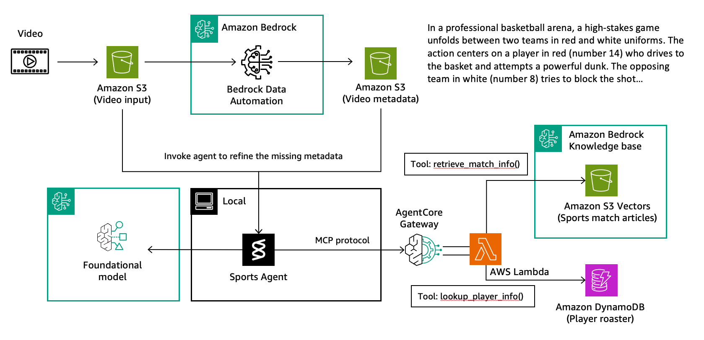

## Scaling Agent Tools with AgentCore Gateway

In the previous notebook, we built a local sports agent using Strands. While perfect for development, production scenarios require a different approach: **How do you scale agent tools across multiple teams and applications?**

**Amazon Bedrock AgentCore Gateway** solves this by transforming your agent tools into secure, scalable APIs. It creates a centralized hub following the Model Context Protocol (MCP), making tools discoverable to any authorized agent across your organization.



## Architecture Overview

The gateway architecture involves two key components:

### 1. Gateway with Authentication
We create an AgentCore Gateway with **Amazon Cognito** for secure access control. Cognito manages authentication using OAuth2 client credentials flow, ensuring only authorized agents can access tools through JWT tokens.

### 2. Lambda Tool Targets  
We migrate our tool logic into **Lambda functions** and register them as gateway targets. Each Lambda registration includes:
- **Outbound permissions** (API keys, OAuth, AWS resource access)
- **API specifications** that define how agents should call the tools

## Tool API Specifications

When registering Lambda functions, we define clear API contracts for each tool:

```python
[
    {
        "name": "retrieve_match_info",
        "description": "Retrieve related match report that may have additional team and player info from sports knowledge base using video metadata",
        "inputSchema": {
            "type": "object",
            "properties": {
                "query": {
                    "type": "string",
                    "description": "Search query describing the game or video content"
                },
                "max_results": {
                    "type": "integer",
                    "description": "Maximum number of results to return (default: 1)"
                }
            },
            "required": [
                "query"
            ]
        }
    },
    {
        "name": "lookup_player_info",
        "description": "Look up detailed player information (name, position, height, weight) from the player database. Requires the exact team name from match reports and the player's jersey number from the video.",
        "inputSchema": {
            "type": "object",
            "properties": {
                "team_name": {
                    "type": "string",
                    "description": "Exact team name with proper capitalization (e.g., 'Alpine Wolves', 'Metropolitan Knights')"
                },
                "player_number": {
                    "type": "string",
                    "description": "Player's jersey number (e.g., '14', '8', '17')"
                }
            },
            "required": [
                "team_name",
                "player_number"
            ]
        }
    }
]
```

## Connecting Agents to the Gateway

Once deployed, the AgentCore Gateway becomes an MCP server that agents can connect to remotely. The connection process involves:

1. **Authentication** - Retrieve access token via Cognito OAuth2 flow
2. **Tool Discovery** - List available tools from the gateway
3. **Agent Creation** - Build agent with remote tools
4. **Execution** - Agent automatically calls gateway tools as needed

### Implementation Example

```python
from mcp.client.streamable_http import streamablehttp_client
from strands.tools.mcp.mcp_client import MCPClient
from strands import Agent

def create_streamable_http_transport():
    return streamablehttp_client(lab_gateway_url,headers={"Authorization": f"Bearer {token}"})

client = MCPClient(create_streamable_http_transport)

with client:
    # Call the listTools 
    tools = client.list_tools_sync()
    # Create an Agent with the model and tools
    agent = Agent(model=model,tools=tools)
    print(f"Tools loaded in the agent are {agent.tool_names}")
    
    result = agent(prompt=prompt)

    # Parse result
    print("\nParsing agent response...")
    try:
        response_text = result.get('output', result) if isinstance(result, dict) else str(result)
        print_result("Final Agent Response",response_text)

    except Exception as e:
        print(f"Error parsing response: {e}")
        print(f"error : {str(e)},\nraw_response: {str(result)}")

```

## What You'll Learn

In this notebook, you'll:
1. **Deploy Gateway Infrastructure** - Set up AgentCore Gateway with Cognito authentication
2. **Migrate Tools to Lambda** - Convert local tools into scalable Lambda functions
3. **Register Tool Targets** - Configure Lambda functions as gateway targets with proper API specs
4. **Connect Remote Agent** - Build an agent that uses tools through the MCP gateway
5. **Test End-to-End** - Verify the same sports analysis functionality now works at scale

The result is a production-ready architecture where multiple agents and teams can securely access shared tools through a centralized, managed gateway.
