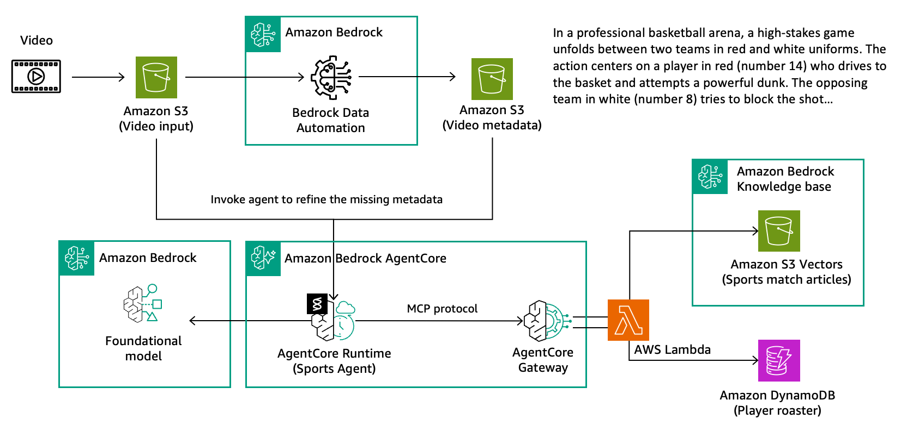

## Deploy Sports Agent to AgentCore Runtime

We've built a local agent with Strands and scaled our tools with AgentCore Gateway. Now comes the final step: **deploying the agent itself to production**.

While the gateway made tools scalable, the agent still runs locally. Production requires a managed environment with auto-scaling, high availability, and zero server management.

**Amazon Bedrock AgentCore Runtime** provides exactly this—a managed container service that runs agents in production with automatic scaling, built-in monitoring, and secure authentication.



## Adapting Code for Runtime

To deploy on AgentCore Runtime, we adapt our agent code using the **BedrockAgentCoreApp** framework. This creates an HTTP server with required endpoints and handles authentication automatically:

```python
from bedrock_agentcore.runtime import BedrockAgentCoreApp # import Bedrock AgentCore library
...
# Initialize the AgentCore Runtime App
app = BedrockAgentCoreApp()
...
@app.entrypoint # define the entry point for the request 
async def invoke(payload, context=None):
    ...

if __name__ == "__main__":
    app.run() # run the application
```

### Key Framework Components

- **BedrockAgentCoreApp** - Creates HTTP server with `/invocations` and `/ping` endpoints
- **app.entrypoint** - Marks your function as the main request handler
- **app.run()** - Starts the HTTP server when the container launches

## Deployment Configuration

Using the **AgentCore Starter Toolkit**, deployment is straightforward. Configure your runtime settings and let the toolkit handle Docker builds, ECR pushes, and runtime creation:

```python
from bedrock_agentcore_starter_toolkit import Runtime

agentcore_runtime = Runtime()

# Configure the deployment
response = agentcore_runtime.configure(
    entrypoint="script/sports_agent.py",
    execution_role=execution_role_arn,
    auto_create_ecr=True,
    requirements_file="script/requirements.txt",
    region=region,
    agent_name="lab_sports_agent",
    authorizer_configuration={
        "customJWTAuthorizer": {
            "allowedClients": [lab_client_id],
            "discoveryUrl": lab_cognito_discovery_url,
        }
    },
)
```

### Security & Launch

The `authorizer_configuration` ensures only valid JWT tokens from allowed Cognito clients can access your agent. Launch initiates the build and deployment process:

```python
# Launch the runtime
launch_result = agentcore_runtime.launch(auto_update_on_conflict=True)
```

## Testing the Deployed Agent

Once deployed, test your production agent by authenticating and invoking it remotely:

```python
# Get access token from Cognito
token_response = cognito_helper.get_token(
    user_pool_id=lab_user_pool_id,
    client_id=lab_client_id,
    client_secret=lab_client_secret,
    scope_string=lab_scope_string
)

token = token_response["access_token"]

# Invoke the runtime
response = agentcore_runtime.invoke(
    {"prompt": "Who are the players in the video?"},
    bearer_token=token,
)

output = response["response"]
```

## Production-Ready Architecture

The runtime automatically handles the complete request lifecycle:
1. **JWT Validation** - Verifies token authenticity and permissions
2. **Request Routing** - Forwards to your containerized agent
3. **Gateway Integration** - Retrieves gateway URL from SSM Parameter Store
4. **Tool Discovery** - Connects to gateway and discovers available tools
5. **Request Processing** - Executes agent logic with full tool access

Your agent now runs in production with enterprise-grade security, auto-scaling, and built-in observability.

## What You'll Learn

In this notebook, you'll:
1. **Adapt Agent Code** - Modify your Strands agent to use BedrockAgentCoreApp framework
2. **Configure Runtime** - Set up deployment parameters, security, and authentication
3. **Deploy to Production** - Use the starter toolkit to build and deploy containers
4. **Test Remote Agent** - Authenticate and invoke your production agent
5. **Monitor Performance** - Observe automatic scaling and built-in monitoring

The result is a fully managed, production-ready agent that maintains the same functionality while providing enterprise scalability and security.
