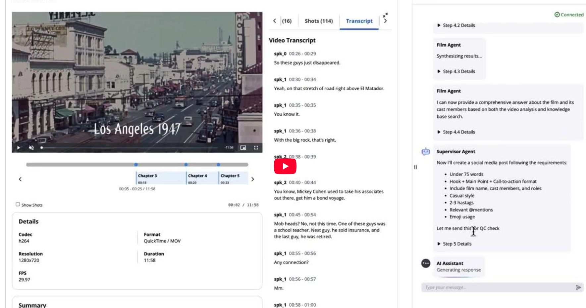
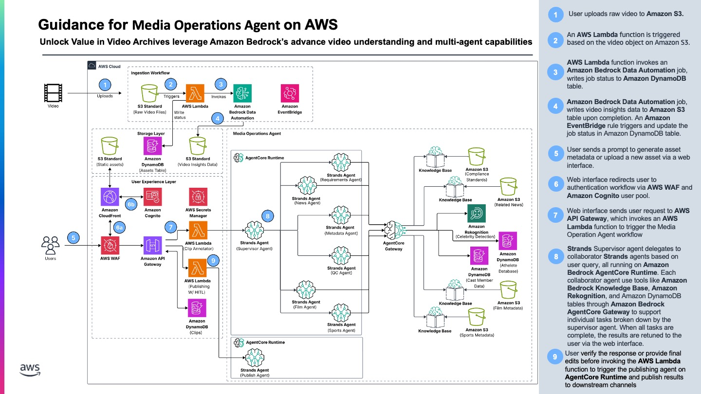

# Multi-Agent Media Operations Workshop

The media industry is experiencing a fundamental shift in how content is processed, analyzed, and monetized. Recent breakthroughs in vision-based generative AI models have dramatically reduced both the cost and complexity of understanding video content at scale. However, the true potential of AI in media workflows extends beyond deterministic processes—many parts of content supply chains require dynamic decision-making and intelligent orchestration. 

This workshop demonstrates how to build an agentic system for media operations using Strands Agents and Amazon Bedrock AgentCore. You'll start by building a single sports analysis agent locally, then progressively scale it to production using AgentCore Gateway and Runtime, and finally expand to a complete multi-agent orchestration system. This progression mirrors real-world development: prototype locally, scale your tools, deploy to production, then orchestrate multiple specialized agents.

---

## Architecture Overview

> **Note:** This workshop focuses on the **agent portion** of a complete media analysis solution. It demonstrates building intelligent agents for content analysis, not the full application.

---

## Workshop Approach: Build → Scale → Deploy → Orchestrate

This workshop follows a practical progression from prototype to production. Starting with a single agent and progessing to deployed mulit-agent patterns. Here are the learning outcomes:

- **Lab 1: Build Sports Agent Using Strands Agents (45 minutes)**
  - Learn the fundamentals of Strands Agents SDK
  - Build a sports video analysis agent with knowledge base and database tools
  - Understand agent components: tools, model, and prompts

- **Lab 2: Scaling Agentic Tooling Using AgentCore Gateway (45 minutes)**

  - Transform local tools into scalable, reusable APIs
  - Implement Model Context Protocol (MCP) for tool sharing
  - Configure authentication with Amazon Cognito

- **Lab 3: Deploy Sports Agent to AgentCore Runtime (45 minutes)**

  - Deploy agents to managed, auto-scaling infrastructure
  - Implement production security with JWT authentication
  - Monitor and invoke agents in the cloud

- **Lab 4: Scaling to Multi-Agent Orchestration (60 minutes)**

  - Build a fleet of specialized agents (Sports, News, Film, Requirements, Metadata, QC)
  - Implement intelligent orchestration with a supervisor agent
  - Handle complex multi-step workflows with agent collaboration

## Resources

- [Strands Agents SDK](https://github.com/awslabs/strands-agents)
- [Amazon Bedrock AgentCore](https://docs.aws.amazon.com/bedrock/latest/userguide/agentcore.html)
- [Model Context Protocol](https://modelcontextprotocol.io/)
