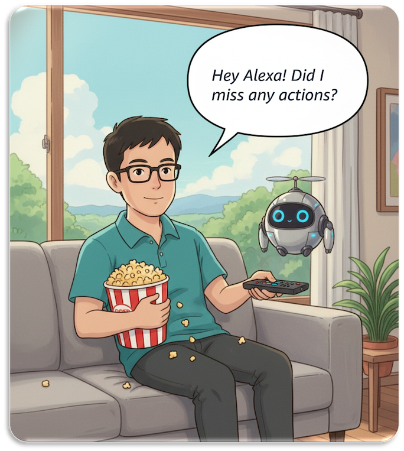

# Build Live Video Understanding Solutions Using Agentic AI On AWS

A hands-on workshop demonstrating how to build live video understanding solutions and use real-time context to power downstream agent applications using AWS Strands Agents and Amazon Bedrock AgentCore.

## 📋 Overview

This workshop demonstrates how to build a **streaming companion agent** that provides viewers with real-time interactive assistance during live streamed shows. The agent offers:

- ✅ Immediate context about current events
- ✅ Ongoing summaries of the stream
- ✅ Quick access to key moments within the stream

The workshop is structured in two parts:

1. **Live Video Understanding**: Implement solutions using AWS services and Amazon Bedrock foundation models to process visual, audio, and multi-modal content in real-time
2. **Intelligent Agent Development**: Develop and deploy an agent using AWS Strands Agents and Amazon Bedrock AgentCore that leverages video understanding to interact with viewers

Through hands-on exercises, you'll learn to address critical streaming challenges including latency requirements, incremental context building, and compute resource optimization.

## 🎯 Target Audience

This workshop is designed for:

- **Media Technology Teams**: Content producers and streaming platform engineers building AI-enhanced video experiences
- **AI/ML Practitioners**: Developers and architects implementing real-time video understanding solutions
- **Solutions Engineers**: Technical professionals integrating AI capabilities into media processing workflows

**Prerequisites**: Basic understanding of AWS services, Python programming, and familiarity with video/audio processing concepts is recommended.

## 🏗️ Architecture

The solution leverages the following AWS services and technologies:

- **[Amazon Bedrock](https://aws.amazon.com/bedrock/)**: Flexible platform for building generative AI applications and agents
- **[Amazon Bedrock AgentCore](https://aws.amazon.com/bedrock/agentcore/)**: Agentic platform to build, deploy and operate agents securely at scale
- **[AWS Strands Agents](https://strandsagents.com/latest/)**: Simple-to-use, code-first framework for building AI agents
- **[Amazon Transcribe](https://aws.amazon.com/transcribe/)**: Fully managed, automatic speech recognition (ASR) service
- **Live Video Source**: Sample live video stream simulated using ffmpeg for analysis
- **Shot Change Detection**: Process of identifying transitions between scenes in a video

## 📚 Workshop Modules

### Module 1: Live Visual Understanding (30 minutes)
Analyze live video frames and detect shot changes using Amazon Bedrock with Nova Lite model for real-time visual understanding.

**Key Topics:**
- Real-time frame extraction and processing
- Shot change detection algorithms
- Visual analysis with Amazon Bedrock Nova Lite

### Module 2: Live Audio Understanding (30 minutes)
Convert speech to text using Amazon Transcribe and analyze content using Nova Lite model for comprehensive audio understanding.

**Key Topics:**
- Amazon Transcribe streaming integration
- Real-time speech-to-text processing
- Audio content analysis with foundation models

### Module 3: Live Multi-Modal Understanding (30 minutes)
Combine visual and audio insights using Claude Sonnet model to create contextual understanding of the live content.

**Key Topics:**
- Multi-modal data fusion
- Context building and management
- Prompt caching and optimization techniques

### Module 4: Live Streaming Companion Agent (30 minutes)
Build and deploy an interactive AWS Strands agent on Amazon Bedrock AgentCore with integrated memory systems for managing video context and handling viewer queries.

**Key Topics:**
- AWS Strands Agents framework
- Amazon Bedrock AgentCore deployment
- Memory management and context retention
- Real-time query handling

**Total Duration**: 2 hours

## 🚀 Getting Started

### Prerequisites

1. **AWS Account** with appropriate permissions for:
   - Amazon Bedrock
   - Amazon Bedrock AgentCore
   - Amazon Transcribe
   - AWS Lambda
   - Amazon S3
   - AWS IAM

2. **Python 3.11+** installed locally

3. **AWS CLI** configured with your credentials

## 📖 Key Learning Points

By completing this workshop, you will learn to:

- ✅ **Live Video Processing**: Implement real-time video understanding solutions that address latency, incremental context, and resource optimization challenges
- ✅ **Foundation Model Integration**: Leverage Amazon Bedrock models for visual analysis, audio processing, and multi-modal understanding of streaming content
- ✅ **Agent Development**: Build an interactive agent using AWS Strands Agents that maintains video context and handles real-time viewer queries
- ✅ **Production Deployment**: Deploy and optimize streaming agents on Amazon Bedrock AgentCore with efficient memory management and cost controls

## 🤝 Contributing

Contributions are welcome! Please feel free to submit a Pull Request.

## 📄 License

This project is licensed under the MIT License - see the [LICENSE](LICENSE) file for details.

## 🙏 Acknowledgments

- AWS Bedrock team for the foundation models
- AWS Strands Agents team for the agent framework
- Amazon Bedrock AgentCore team for the deployment platform

## 📞 Support

For questions or issues:
- Open an issue in this repository
- Refer to [AWS Bedrock Documentation](https://docs.aws.amazon.com/bedrock/)
- Check [AWS Strands Agents Documentation](https://strandsagents.com/latest/)

## 🔗 Additional Resources

- [Amazon Bedrock](https://aws.amazon.com/bedrock/)
- [Amazon Bedrock AgentCore](https://aws.amazon.com/bedrock/agentcore/)
- [AWS Strands Agents](https://strandsagents.com/latest/)
- [Amazon Transcribe](https://aws.amazon.com/transcribe/)

---

**Built with ❤️ using AWS Services**
